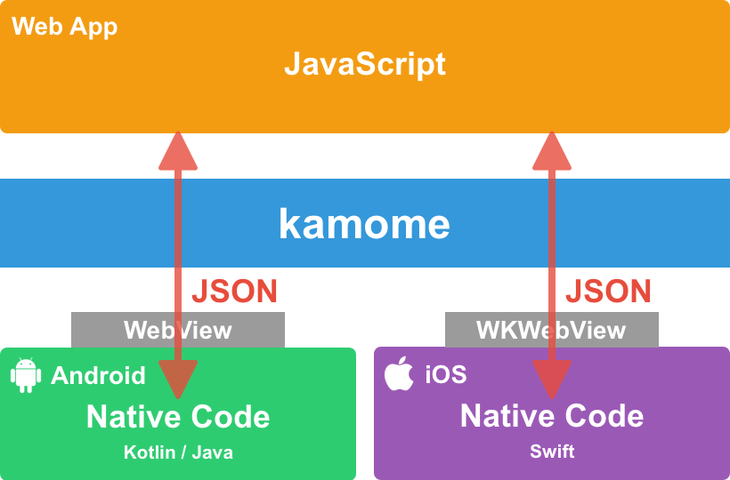

# kamome

***Kamome is iOS/Android library sending messages between JavaScript and native code written by Swift/Objective-C or Java in the WebView.***



Kamome provides common JavaScript interface for iOS and Android.

## Include in your app

1. Downloads latest [kamome SDK](https://github.com/HituziANDO/kamome/releases)

1. Imports kamome.js
	
	```html
	<script src="kamome.js"></script>
	```
	
	Or copies the code in [kamome.js](https://github.com/HituziANDO/kamome/blob/master/js/src/kamome.js) to your JavaScript.

1. Imports KamomeSDK.framework to your iOS app
	
	### CocoaPods
	
	Kamome is available through [CocoaPods](http://cocoapods.org). To install
it, simply add the following line to your Podfile:
	
	```ruby
	pod "KamomeSDK"
	```
	
	### Manual Installation
	
	1. Drags & Drops KamomeSDK.framework into your Xcode project
	
1. Writes the import statement in your source code
	
	**Swift**
	
	```swift
	import KamomeSDK
	```
	
	**Objective-C**
	
	```objc
	#import <KamomeSDK/KamomeSDK.h>
	```

1. Imports kamome-x.x.x.jar to your Android app
	
	### Gradle
	
	Adds the following code in build.gradle(project level).
	
	```groovy
	allprojects {
		repositories {
			
			maven {
				url 'https://hituziando.github.io/kamome/android/repo'
			}
		}
	}
	```
	
	Adds the following code in build.gradle(app level).
	
	```groovy
	dependencies {
		
		implementation 'jp.hituzi:kamome:1.5.0'
	}
	```
	
	### Manual Installation
	
	1. Copies kamome-x.x.x.jar to `YOUR_ANDROID_STUDIO_PROJECT/app/libs` directory
	1. Sync Project in AndroidStudio

## Usage

### JavaScript to Native Code

1. Sends a message from JavaScript and then receives callback
	
	```javascript
	// Sends `echo` command
	Kamome.send('echo', { message: 'Hello' }, function (data, error) {
	    if (!error) {
	        // Callback from the native if succeeded
	        console.log(data.message);
	    } else {
	        // Callback from the native if failed
	        console.log(error);
	    }
	});
	```
	
	Or returns Promise
	
	```javascript
	Kamome.send('echo', { message: 'Hello' }).then(function (data) {
	    // Callback from the native if succeeded
	    console.log(data.message);
	}).catch(function (error) {
	    // Callback from the native if failed
	    console.log(error);
	});
	```

1. Receives a message on iOS
	
	**Swift**

	```swift
	// Properties
	private var webView: WKWebView!
	private var kamome:  KMMKamome!
	```
	
	```swift
	// Creates a kamome instance with default webView
	var webView: AnyObject!
   kamome = KMMKamome.create(webView: &webView, class: WKWebView.self, frame: view.frame)
   self.webView = webView as? WKWebView
	
	// Registers `echo` command
	kamome.add(KMMCommand(name: "echo") { data, completion in
	          // Receives `echo` command
	          
	          // Then sends resolved result to the JavaScript callback function
	          completion.resolve(with: ["message": data!["message"]!])
	          // Or sends rejected result if failed
	          //completion.reject(with: "Error message")
	      })
	
	// Adds the webView to a ViewController's view
	view.addSubview(self.webView)
	```
	
	**Objective-C**
	
	```objc
	@property (nonatomic) KMMKamome *kamome;
	@property (nonatomic) WKWebView *webView;
	```
	
	```objc
	// Creates a kamome instance with default webView
    WKWebView *webView = nil;
    self.kamome = [KMMKamome createInstanceAndWebView:&webView class:[WKWebView class] frame:self.view.frame];
    self.webView = webView;
	
	// Registers `echo` command
	[self.kamome addCommand:[KMMCommand commandWithName:@"echo" handler:^(NSDictionary *data, KMMCompletion *completion) {
	    // Receives `echo` command
	    
	    // Then sends resolved result to the JavaScript callback function
	    [completion resolveWithDictionary:@{ @"message": data[@"message"] }];
	    // Or sends rejected result if failed
	    //[completion rejectWithErrorMessage:@"Error message"];
	}]];
	
	// Adds the webView to a ViewController's view
	[self.view addSubview:self.webView];
	```
	
	**[NOTE]** Supports WKWebView only. UIWebView not supported.
	
1. Receives a message on Android
	
	```java
	// Instance variable
	private Kamome kamome;
	```
	
	```java
	WebView webView = (WebView) findViewById(R.id.webView);
	
	try {
	    kamome = Kamome.createInstanceForWebView(webView);
	    
	    // Registers `echo` command
	    kamome.addCommand(new Command("echo", new Command.IHandler() {
	        
	        @Override
	        public void execute(JSONObject data, Completion completion) {
	            // Receives `echo` command
	            
	            try {
	                // Then sends resolved result to the JavaScript callback function
	                completion.resolve(new JSONObject().put("message", data.getString("message")));
	                // Or sends rejected result if failed
	                //completion.reject("Error message");
	            } catch (JSONException e) {
	                e.printStackTrace();
	            }
	        }
	    }));
	} catch (ApiVersionException e) {
	    e.printStackTrace();
	}
	```

### Native Code to JavaScript

1. Sends a message from native code and then receives callback

	#### iOS
	
	**Swift**
	
	```swift
	// Sends data to JavaScript
	kamome.sendMessage(with: ["greeting": "Hello!"], block: { result in
	    guard let result = result else { return }
	    print("result: \(result)")    // => 'World!'
	}, forName: "greeting")
	```
	
	**Objective-C**
	
	```objc
	// Sends data to JavaScript
	[self.kamome sendMessageWithDictionary:@{ @"greeting": @"Hello!" }
                                     block:^(id result) {
                                         NSLog(@"result: %@", result);	// => 'World!'
                                     }
                                   forName:@"greeting"];
	```
	
	#### Android
	
	```java
	try {
	    // Sends a data to JavaScript
	    kamome.sendMessage(new JSONObject().put("greeting", "Hello!"),
	        "greeting",
	        new Kamome.IResultCallback() {
	            
	            @Override
	            public void onReceiveResult(Object result) {
	                Log.d(TAG, "result: " + result);	// => 'World!'
	            }
	        });
	} catch (JSONException e) {
	    e.printStackTrace();
	}
	```
	
1. Receives a message on JavaScript
	
	```javascript
	Kamome.addReceiver('greeting', function (data) {
	    console.log(data.greeting);	// => 'Hello!'
	    
	    // Returns a result to the native code.
	    return 'World!';	// Any object or null.
	});
	```

### Configuration

#### Request Timeout from JavaScript to Native Code

`Kamome.send` method in JavaScript expects a 'resolve'/'reject' response will be returned in a duration. If the request is timed out, it's callback calls `reject` with requestTimeout error. You can change default request timeout, see following.

```javascript
// Sets default timeout in millisecond.
Kamome.setDefaultRequestTimeout(15000);
```

If given time <= 0, the request timeout function is disabled.

If you want to specify a request timeout individually, you set a timeout in millisecond at `Kamome.send` method's 4th argument.

```javascript
// Sets a timeout in millisecond at 4th argument.
const promise = Kamome.send(commandName, data, null, 5000);
```

---

More info, see my [iOS sample project](https://github.com/HituziANDO/kamome/tree/master/ios) and [Android sample project](https://github.com/HituziANDO/kamome/tree/master/android).
